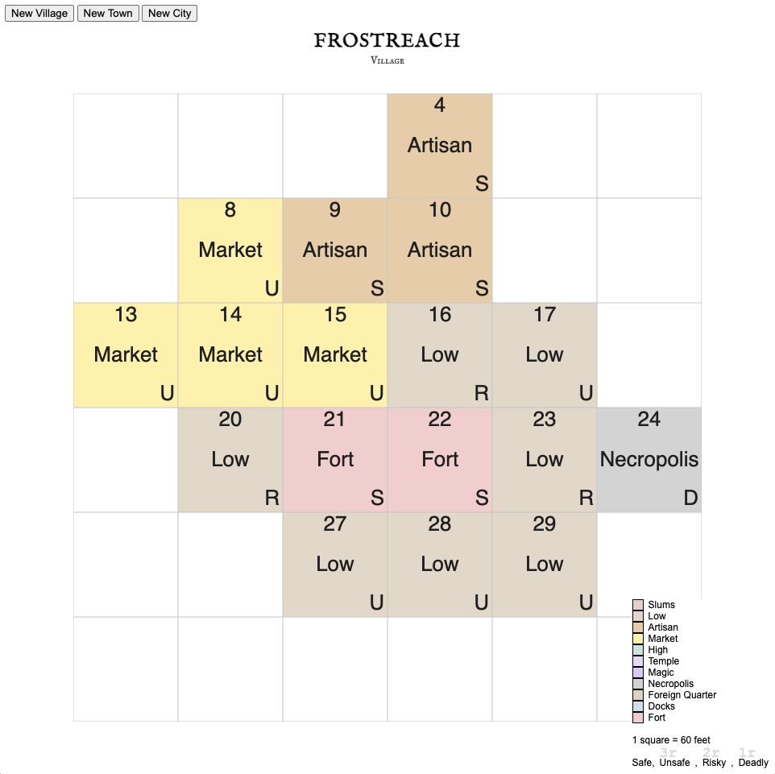

# settlementmap
Generate a map for a village, a town, or a city. Each square is 30ft

## Install
If you haven't already, install `serve` globally with `npm install --global serve`

## Run locally
In a terminal, run `serve .` from the root of this directory and browse to http://localhost:3000

## How to use
Right-click on a square if you want to manually change its district type.

Click on the button `DM / Players` to toggle the details on and off.

Switch between colour and grayscale.

Click on `New Map` to generate a branch new map with new Points of Interest.

